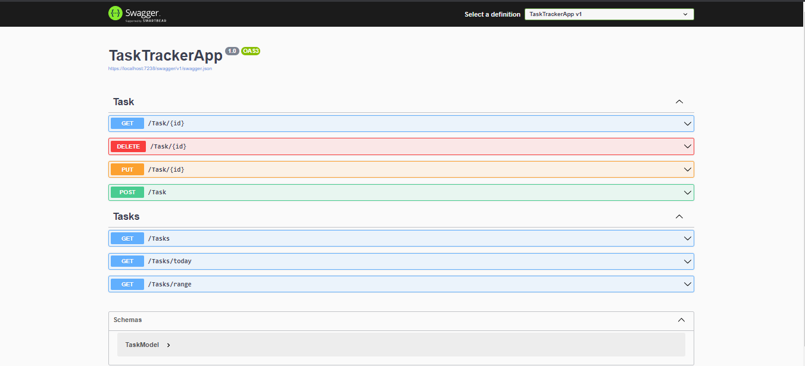

# Task Tracker Rest API 
The REST API for the Task Tracker App provides a user-friendly interface for seamless communication between the front-end and back-end components of the application. This API enables the user to easily perform CRUD (Create, Read, Update, Delete) operations on tasks, such as adding new tasks, updating their status, and deleting tasks. It also allows for the retrieval of tasks from the database based on different parameters,such as sorted/unsorted, ascending/descending and given interval of datetime.


## Table of contents

- [Overview](#overview)
  - [Screenshot](#screenshot)
- [How to use it](#how-to-use-it)
- [My process](#my-process)
  - [Built with](#built-with)
  - [What I learned](#what-i-learned)
- [Author](#author)


## Overview

With this app you can :
- GET, POST, PUT, DELETE Task by id.
- GET Tasks sorted by date ascending/descending, without/with filter.
- GET tasks of today and GET tasks in specific interval of Date and time.

### ScreenShot




## How to use it
First of all fill free to clone this repository.

- You can choose which database you want to use and add the entity framework core package relative to your database.
For example in my case 
```
dotnet add package MySql.EntityFrameworkCore
```
- In [``TaskTrackerApp/Models/TaskDb.cs``](./TaskTrackerApp/Models/TaskDb.cs) edit the code according to your chosen package.
```C#
using Microsoft.EntityFrameworkCore;

namespace TaskTrackerApp.Model
{
    public class TaskDb : DbContext
    {

        protected readonly IConfiguration Configuration;

        public TaskDb(IConfiguration configuration)
        {
            Configuration = configuration;

        }

        protected override void OnConfiguring(DbContextOptionsBuilder options)
        {
          //Edit the code below
            options.UseMySQL(Configuration.GetConnectionString("WebApiDatabase"));
        }

        public DbSet<TaskModel> Tasks { get; set; }
    }
}

```
- In [``TaskTrackerApp/appsettings.json``](./TaskTrackerApp/appsettings.json) write the connection string of your database.
```json
{

  "ConnectionStrings": {
    //Edit this connection string
    "WebApiDatabase": "server=url;port=port;database=task;user=username;password=password"
  }, 
    "Logging": {
      "LogLevel": {
        "Default": "Information",
        "Microsoft.AspNetCore": "Warning"
      }
    },
    "AllowedHosts": "*"
  }

```
## My process

### Built With

- [Asp.net Core v6.0](https://learn.microsoft.com/en-us/aspnet/core/introduction-to-aspnet-core?view=aspnetcore-6.0)
- [Swagger UI](https://swagger.io/tools/swagger-ui/) which generates automatically a UI which allows user to interact with API's resourses.
- [MySQL](https://www.mysql.com/)
- [EntityFrameworkCore](https://learn.microsoft.com/en-us/ef/)


### What I learned

Throughout this project, I acquired knowledge in several areas, including:
- Understanding REST APIs and their functionality.
- Managing HTTP requests containing query strings.
- Implementation of REST API in Asp.net core with Entity Framework Core.

## Author
- <a href="https://www.linkedin.com/in/alaa-ballout/" rel="nofollow noreferrer">
      Alaa Ballout
  </a>
- <a href="mailto:alaaballoutdev@gmail.com">
     alaaballoutdev@gmail.com
  </a>

